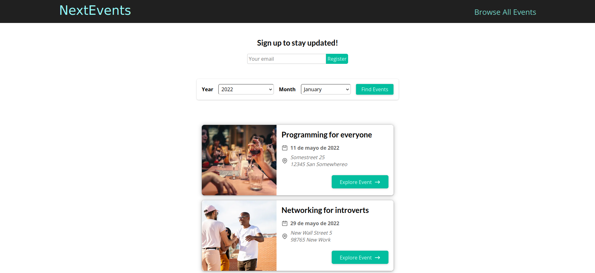

<h3 align="center"> NextJS Events
    <br> 
</h3>

<div align="center">

[]()
[](/LICENSE)

</div>

---

This is a [Next.js](https://nextjs.org/) project bootstrapped with [`create-next-app`](https://github.com/vercel/next.js/tree/canary/packages/create-next-app).

## Table of Contents

- [About](#about)
- [Getting Started](#getting_started)
- [Usage](#usage)
- [Deployment](#deployment)
- [Built Using](#built_using)
- [Authors](#authors)

## About <a name = "about"></a>

The purpose of this project is to create a page for finding meetup events
### Prerequisites <a name = "prerequisites"></a>

You will need to have [Nodejs](https://nodejs.org/en/) in your system.

Check the documentation to install it on your system.

### Installing

Once you have Node Js on your system, run `npm install` in order to get all the dependencies needed. You can see in the package.json all the scripts.

## Getting Started <a name = "getting_started"></a>

This project uses firebase for fetching the events and mongoDB for storing comments, so if you want to run it locally you should create a .env file and provide your own databases urls.

Then, run the development server:

```bash
npm run dev
# or
yarn dev
```

Open [http://localhost:3000](http://localhost:3000) with your browser to see the result.

## Usage <a name="usage"></a>

</a>

You can make changes in the components and pages folders.
Run `npm run dev` to see in the browser all the changes that you do in the page.

## Deployment <a name = "deployment"></a>

The easiest way to deploy your Next.js app is to use the [Vercel Platform](https://vercel.com/new?utm_medium=default-template&filter=next.js&utm_source=create-next-app&utm_campaign=create-next-app-readme) from the creators of Next.js.

Check out our [Next.js deployment documentation](https://nextjs.org/docs/deployment) for more details.

## Built Using <a name = "built_using"></a>

- [React](https://reactjs.org/) - A JavaScript library for building user interfaces
- [Next.js](https://nextjs.org/) - The React Framework for the Web
- [SWR](https://swr.vercel.app/) - React Hooks for Data Fetching

## ✍️ Authors <a name = "authors"></a>

- [@alejandrocardozo](https://github.com/Alejandro-Cardozo) - Build by
- [@academind](https://github.com/academind) - Idea & Initial Work